# BM-Matic — user guide for the admin panel

This guide is for the people who run the website: how to handle the day's requests, change the texts, manage the
photos and reviews, and what to do when something does not work. It is written in plain language; nothing here needs
technical knowledge.

*Nederlandstalige versie: [USER-GUIDE.nl.md](USER-GUIDE.nl.md).* The screenshots show example data.

**Contents** — [Signing in](#signing-in) · [Every day: requests](#every-day-requests) ·
[The texts of the website](#the-texts-of-the-website) · [Photos and logos](#photos-and-logos) ·
[Google reviews](#google-reviews) · [Appearance](#appearance) · [Settings](#settings) · [Users](#users) ·
[Two-factor authentication](#two-factor-authentication) · [When something goes wrong](#when-something-goes-wrong)

---

## Signing in

Sign in at the secret admin address you received when the site was installed (something like
`https://bm-matic.be/admin-7f3kq2`) — keep it in your password manager. The panel speaks English, French and Dutch;
switch under **Settings → Languages → Admin panel language**.

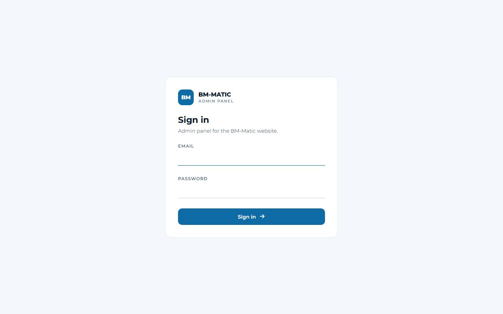

After 30 minutes without activity you are signed out; your work is safe, just sign in again. After a few wrong
passwords the account is locked for 15 minutes — see [When something goes wrong](#when-something-goes-wrong).

**Forgot your password?** under the sign-in button sends a link to your email address. It works once, for one hour;
choose a new password and sign in. Two-factor authentication stays on.

## Every day: requests

### The dashboard

The first screen shows what needs attention: requests of the last seven days, unread messages, the Google rating,
how many reviews are on the website (and how many wait for your approval), and the newest requests. The **quick
controls** on the right switch online booking, the reviews section on the home page and maintenance mode on or off;
they save themselves and a short message confirms it.

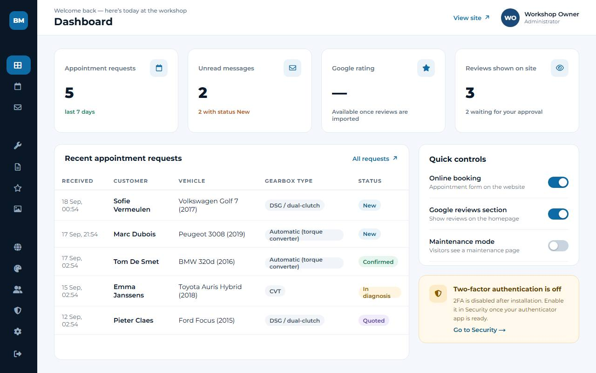

### Appointments and Messages — the same requests, two ways of looking at them

Everything a visitor sends through the appointment form is one **request**. The panel shows those requests twice:

- **Messages** is the inbox. It starts with the unread ones, newest first. Opening a request marks it read; with
  **Mark as unread** you put it back, for example when a colleague has to look at it later.
- **Appointments** is the work list. Filter by status, date or search text, open a request, and follow it through its
  status: New → Confirmed → In diagnosis → Quoted → Done (or Cancelled).

Read or unread has nothing to do with the status: moving a request back to "New" does not make it unread again, and
marking something unread does not change its status.

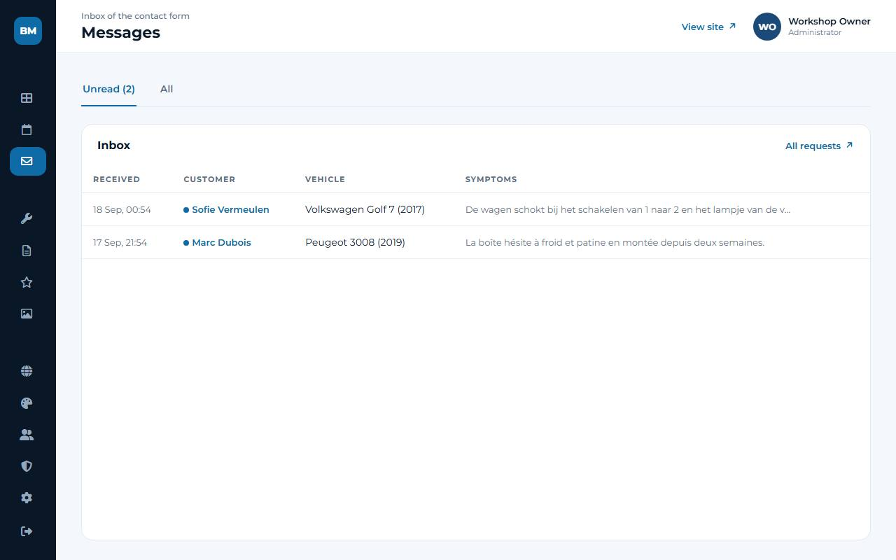

### Handling a request, step by step

1. Open **Messages** and click the request. You see the customer, the car, the gearbox type and the symptoms.
2. **Reply** — **Reply by email** opens your own mail program with the customer's address and a subject in the
   customer's language already filled in. Or simply call: on a phone the number is a link.
3. **Change the status** on the right (for example to *Confirmed* once the appointment is made) and press **Save
   changes**. The customer only gets an email about the new status if you switched that on for that status in
   **Settings → Email → Emails to customers** (a ✉ next to a status shows it is on); by default nothing is sent.
4. **Internal notes** — write what was agreed, what the diagnosis showed or who calls back. Only your team sees the
   notes, with who wrote them and when.

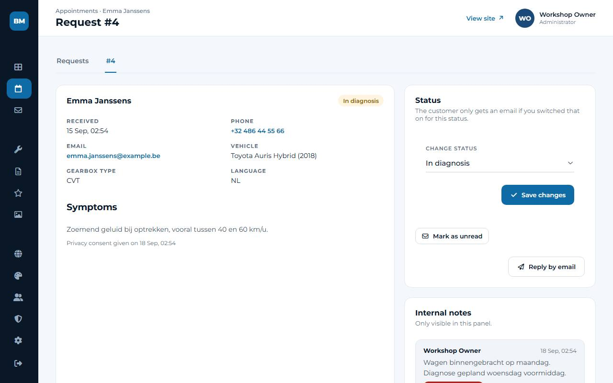

The **Appointments** list can be exported to a spreadsheet (**Export CSV**) with the filters you set. Every status
change, note and export is recorded in the security log.

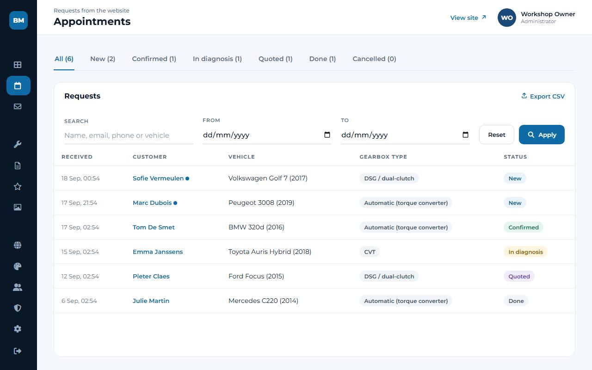

## The texts of the website

### Pages

**Pages** holds the pages of the website. Each page has a tab per language (NL, FR, EN) with the texts, the web
address and the fields search engines show (the SEO title and description).

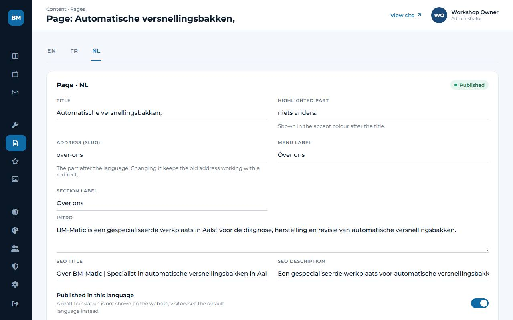

- Write the text in one language, press **Save**, then switch to the next tab. Each language is kept apart.
- A **draft** translation is not shown to visitors; they see the default language instead. Switch **Published in this
  language** on when the text is ready. A dot behind a language tab means it is still a draft.
- Changing the web address of a page keeps the old address working: the panel adds a redirect by itself, so links
  people saved or Google knows keep working.
- On the home page you also see its **sections**. Drag them into another order (or use the arrow buttons), switch the
  ones you do not need off, and press **Save order**. **Edit texts** opens the texts of a section, per language.

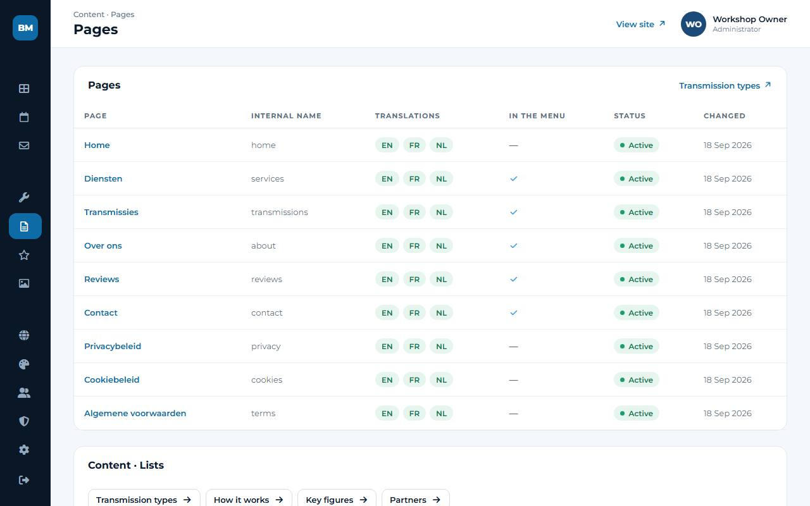

### Services and the short lists

**Services** works the same way, plus an icon you pick from a fixed set and switches for the menu and the home page. A
new service starts invisible, so you can write it in peace. Deleting a service sends its old address to the services
page.

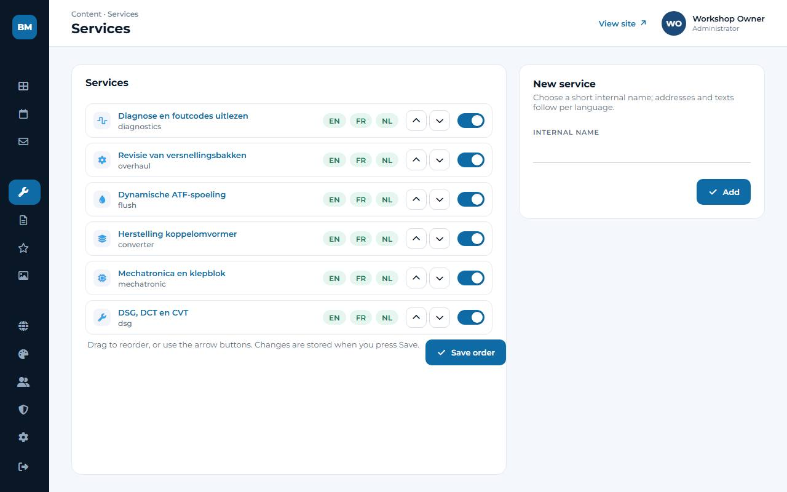

**Transmission types**, **How it works**, **Key figures** and **Partners** are short lists: one row per item with the
texts of the language you are editing, an order and a visibility switch.

The **legal pages** (privacy policy, cookie policy, terms) were delivered as templates for Belgian law. Everything in
[square brackets] must be completed — and the texts checked — before the website goes live.

## Photos and logos

**Media** holds the logo, partner logos and photos. Only PNG, JPEG and WebP are accepted (at most 6 MB and 25
megapixels — a normal phone photo is fine). Every image is re-encoded when it arrives, so location data from a phone
never reaches the website.

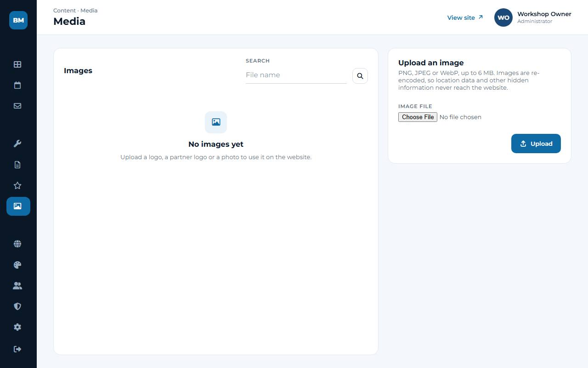

- Give every image an **alt text** in each language — one short sentence describing what is on it. Screen readers read
  it out and search engines use it.
- **Replace file** swaps the file but keeps the image wherever it is used.
- Before deleting, the panel tells you where an image is used ("Pages (2)"), so nothing disappears by accident.

## Google reviews

The reviews your customers leave on Google, in one list. New reviews arrive **hidden**: nothing appears on the website
until you switch it on in the **On website** column. **Show all** / **Hide all** does that for everything matching the
filters at once. The tabs count what you have: all, visible, hidden.

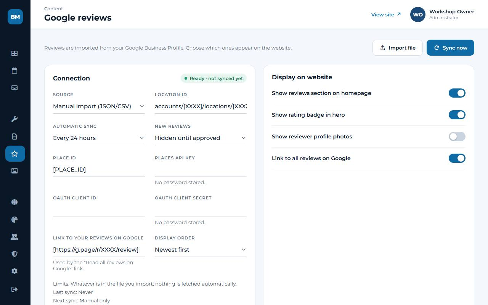

The stars and the number of reviews are always Google's own figures — the website never averages the reviews you
happen to show, because that would mislead visitors (and European consumer rules do not allow it). That is also why
the "Google reviews" label, the "via Google" note on each review and the link to your Google profile stay.

The **Connection** card says where the reviews come from, when they were last fetched, when the next fetch is due, and
what went wrong if something did. A broken connection never affects the website: what you approved stays online.
Setting it up with Google is explained step by step in [docs/GOOGLE-REVIEWS.md](docs/GOOGLE-REVIEWS.md).

## Appearance

The logo, the favicon, the colours, the corner radius and the motion setting. Click the coloured square in front of a
colour code to pick a colour, or type the code yourself. The colour fields show a live contrast check: below 4.5:1 text becomes hard to read for many people, and the panel warns you. **Reset to the approved
design** puts everything back to the design that was signed off.

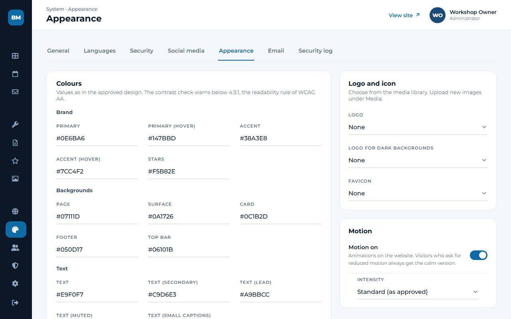

## Settings

- **General** — company details (name, VAT number), address, phone, email, opening hours, and switches for online
  booking, the mobile action bar and maintenance mode.
- **Languages** — which languages visitors can choose, which one is the default, and how much of the interface is
  translated.
- **Social media** — one line per network: the link, and whether it appears in the header, the footer or both.
- **Email** — the mail server that sends the appointment emails, **Send test email**, and **Emails to customers**: per
  status a switch and a text in each language (ready-made texts are included; everything is off until you switch a
  status on).
- **Security** — two-factor authentication, the login lockout, the session timeout, Force HTTPS and the admin address.
  **Security log** shows who did what, and can be filtered and exported.
- **Maintenance** (administrators) — the tasks that otherwise need your developer's command line:
  - **Scheduled tasks**: the secret address that an outside service (cron-job.org) opens every 15 minutes, so emails
    go out, reviews are imported and a backup is made every day. **Run now** does it at once; **New address**
    replaces the address if it ever leaked (then paste it at cron-job.org again).
  - **Backups**: **Make a backup**, **Download** one to keep a copy off the server (do this now and then), and
    **Upload** a backup you downloaded earlier.
  - **Restore a backup**: puts the whole website back as it was at that backup — choose it, enter your password and
    type RESTORE. A backup of the current state is made first, so you can go back. Everyone signs in again
    afterwards; you keep signing in with your current email address and password. This also works on a **new
    installation**: install the site, sign in, **Upload** the backup you downloaded earlier and restore it. The
    admin address of the new installation stays. Afterwards check Settings → Email and switch two-factor
    authentication on again (it cannot be carried over).
  - **Uptime monitor**: the address for a monitoring service. **Before going live**: every [placeholder], missing
    translation or alt text that is left. **Analytics**: off, Google Analytics or Plausible (only after a visitor's
    consent).

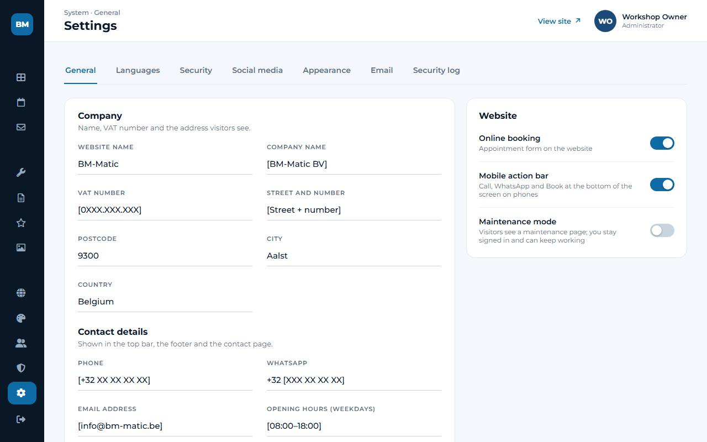

## Users

Invite a colleague by email: they receive a link that is valid for three days and choose their own password.

- An **Administrator** may do everything.
- An **Editor** works with requests, texts, photos and reviews, but does not see users, settings, security or
  appearance.

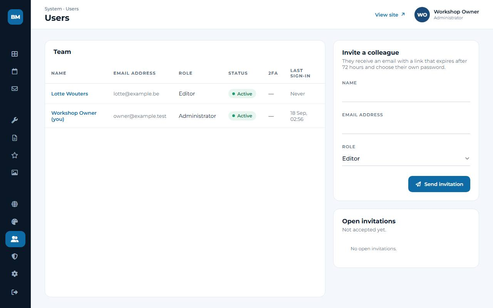

Users are never deleted, because the security log has to keep making sense — deactivate them instead, which can be
undone at any time. The last active administrator cannot be deactivated or demoted, so the panel can never lock
everybody out.

Your own name, email address and password are under **My profile**. A new email address only takes effect after you
confirm it from that address, and changing your password signs out your other devices.

## Two-factor authentication

Two-factor authentication means that signing in needs your password **and** a six-digit code from an app on your phone
(Google Authenticator, Microsoft Authenticator, 1Password, Bitwarden…). Someone who learns your password still cannot
get in. Switch it on for every administrator.

1. **Security → Enable two-factor authentication**, and confirm with your password.
2. Scan the QR code with the app and type the six-digit code it shows.
3. You get **ten recovery codes**. Store them in your password manager, or print them and keep them somewhere safe:
   each code works once, for when your phone is lost.

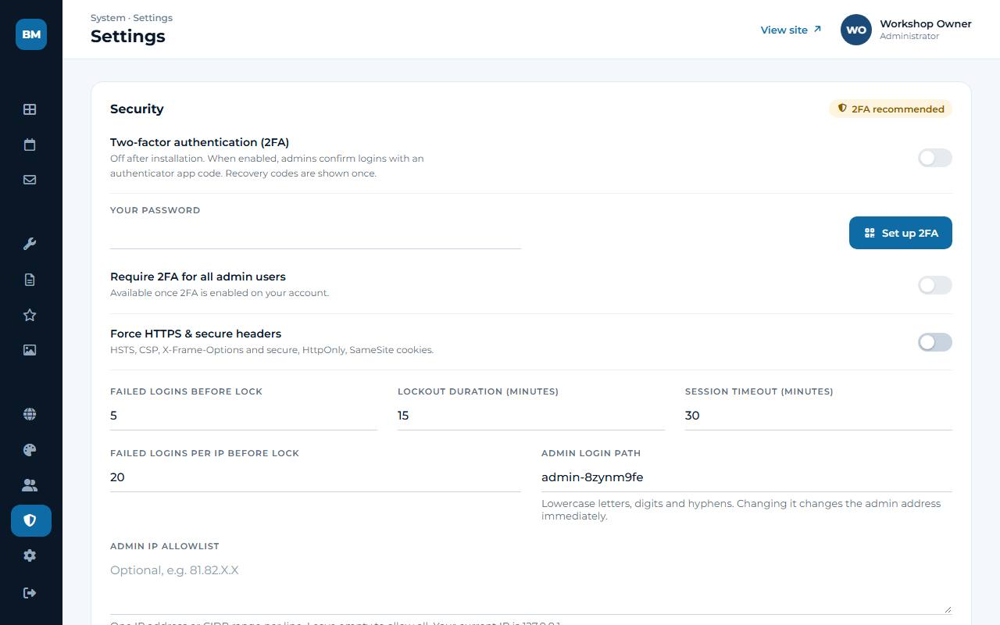

From then on the panel asks for the code after your password. An administrator can require two-factor authentication
for everybody under **Security**.

## When something goes wrong

| What you see | What to do |
| --- | --- |
| "Page not found" at the admin address | Check the address in your password manager; your developer can print it again. |
| Your account is locked after wrong passwords | Wait 15 minutes, or ask your developer to unlock it. |
| You lost your password | Click **Forgot your password?** on the sign-in page and follow the link in the email. No email? Check the spam folder, or ask your developer. |
| You lost your phone with the authenticator app | Sign in with one of your recovery codes and set up two-factor authentication again. No codes left: your developer can reset it. |
| "Something went wrong" with a code (for example 7K2QF9XM) | Note the code and send it to your developer — it points to exactly what happened. |
| Customers say the form does not work | Check that **Online booking** is on and maintenance mode is off (dashboard), then send yourself a test request. |
| Appointment emails do not arrive | **Settings → Email → Send test email**; check the spam folder; tell your developer if the test fails. |
| Reviews are not updated any more | Open **Google reviews**: the connection card says why ([docs/GOOGLE-REVIEWS.md](docs/GOOGLE-REVIEWS.md)). The website keeps showing what you approved. |
| You changed or deleted something by mistake | Most changes can simply be made again. For lost texts or photos, an administrator can restore last night's backup in **Settings → Maintenance** (everything after that backup is lost, so ask first). |

Your developer's routine for backups, updates and monitoring is in [MAINTENANCE.md](MAINTENANCE.md).
