# BM-Matic — handleiding voor het beheerpaneel

Deze handleiding is voor wie de website dagelijks gebruikt: hoe u de aanvragen van de dag afhandelt, de teksten
aanpast, foto's en reviews beheert, en wat u doet als iets niet werkt. Er is geen technische kennis voor nodig.

*English version: [USER-GUIDE.md](USER-GUIDE.md).* De schermafbeeldingen tonen voorbeeldgegevens.

**Inhoud** — [Aanmelden](#aanmelden) · [Elke dag: aanvragen](#elke-dag-aanvragen) ·
[De teksten van de website](#de-teksten-van-de-website) · [Foto's en logo's](#fotos-en-logos) ·
[Google-reviews](#google-reviews) · [Vormgeving](#vormgeving) · [Instellingen](#instellingen) ·
[Gebruikers](#gebruikers) · [Tweestapsverificatie](#tweestapsverificatie) · [Als er iets misloopt](#als-er-iets-misloopt)

---

## Aanmelden

U meldt zich aan op het geheime beheeradres dat u bij de installatie kreeg (iets als
`https://bm-matic.be/admin-7f3kq2`) — bewaar het in uw wachtwoordbeheerder. Het paneel is er in het Nederlands, Frans
en Engels; u kiest de taal bij **Instellingen → Talen → Taal beheerpaneel**.

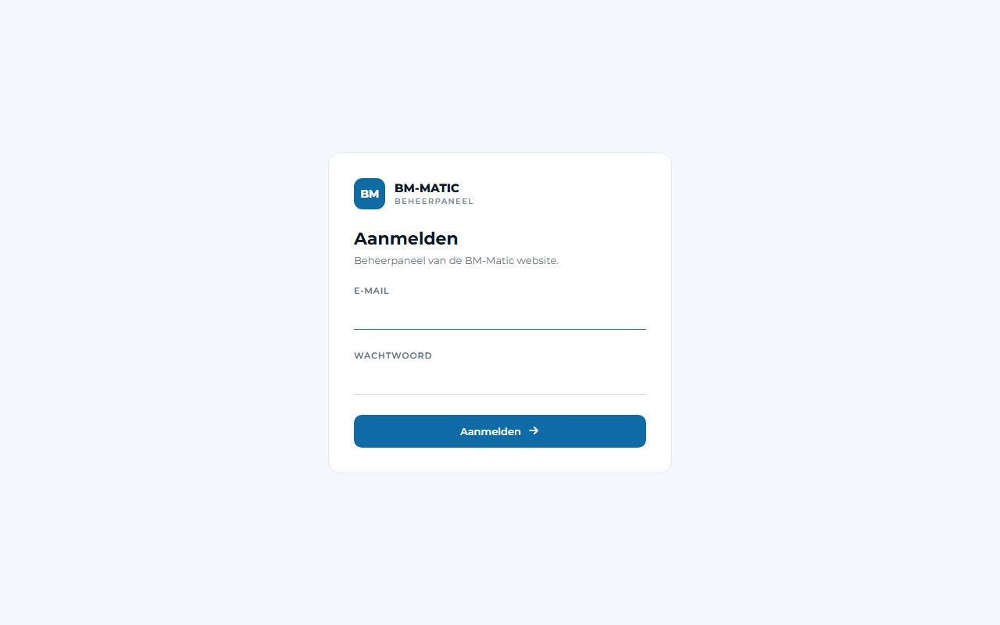

Na 30 minuten zonder activiteit wordt u afgemeld; uw werk is bewaard, meld u gewoon opnieuw aan. Na enkele foute
wachtwoorden wordt het account 15 minuten geblokkeerd — zie [Als er iets misloopt](#als-er-iets-misloopt).

**Wachtwoord vergeten?** onder de aanmeldknop stuurt een link naar uw e-mailadres. Die werkt één keer, één uur lang;
kies een nieuw wachtwoord en meld u aan. Tweestapsverificatie blijft aan.

## Elke dag: aanvragen

### Het dashboard

Het eerste scherm toont wat aandacht vraagt: de aanvragen van de laatste zeven dagen, de ongelezen berichten, de
Google-score, hoeveel reviews er op de website staan (en hoeveel er op uw goedkeuring wachten) en de nieuwste
aanvragen. Met de **snelle instellingen** rechts zet u online boeken, de reviewsectie op de homepage en de
onderhoudsmodus aan of uit; ze bewaren zichzelf en een kort bericht bevestigt het.

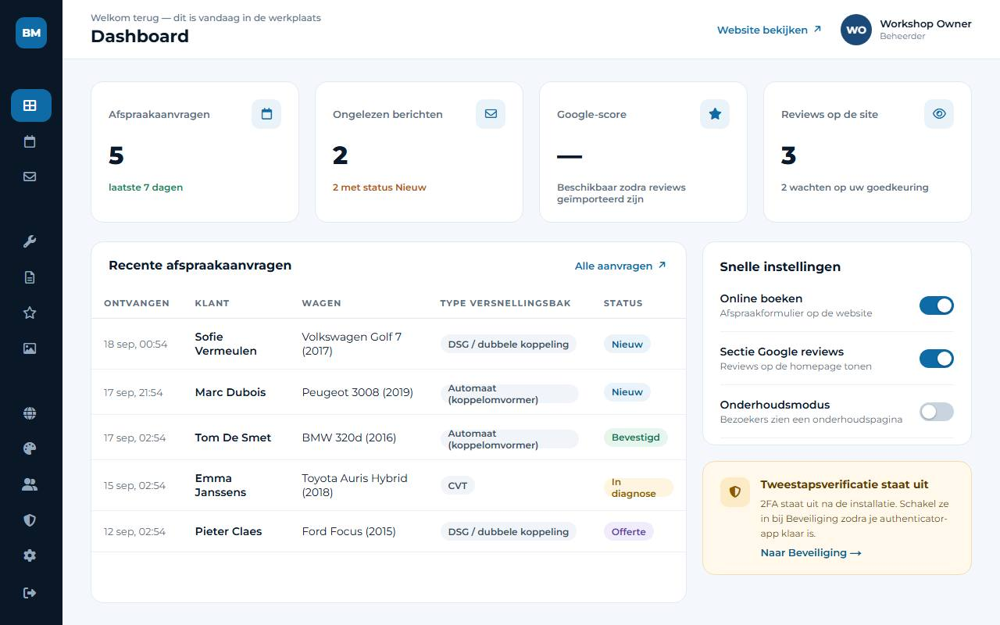

### Afspraken en Berichten — dezelfde aanvragen, op twee manieren bekeken

Alles wat een bezoeker via het afspraakformulier stuurt, is één **aanvraag**. Het paneel toont die aanvragen twee keer:

- **Berichten** is de inbox. Die begint met de ongelezen aanvragen, nieuwste eerst. Een aanvraag openen markeert ze als
  gelezen; met **Als ongelezen markeren** zet u ze terug, bijvoorbeeld als een collega er later naar moet kijken.
- **Afspraken** is de werklijst. Filter op status, datum of zoektekst, open een aanvraag en volg ze door haar status:
  Nieuw → Bevestigd → In diagnose → Offerte → Afgewerkt (of Geannuleerd).

Gelezen of ongelezen staat los van de status: een aanvraag terugzetten naar "Nieuw" maakt ze niet opnieuw ongelezen,
en iets als ongelezen markeren verandert de status niet.

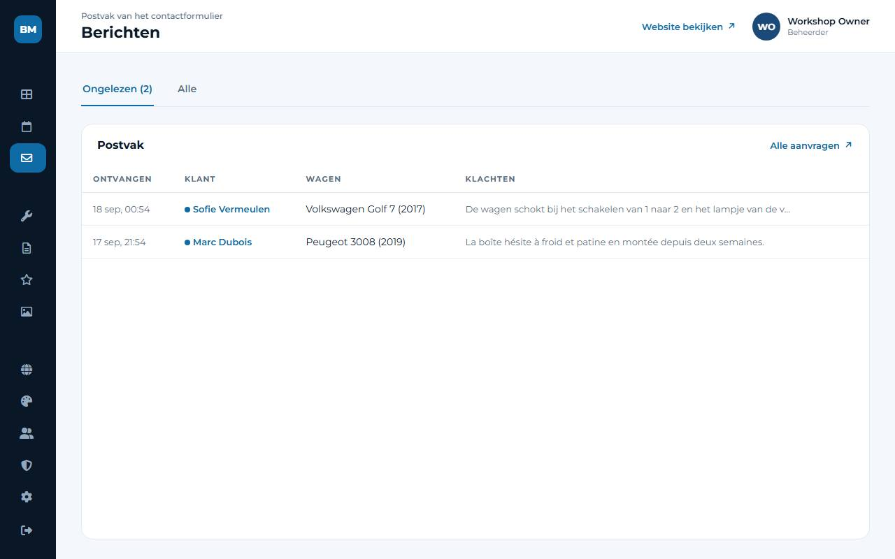

### Een aanvraag afhandelen, stap voor stap

1. Open **Berichten** en klik op de aanvraag. U ziet de klant, de wagen, het type versnellingsbak en de klachten.
2. **Antwoorden** — **Antwoorden per e-mail** opent uw eigen mailprogramma met het adres van de klant en een onderwerp
   in de taal van de klant al ingevuld. Of bel gewoon: op een smartphone is het nummer een link.
3. **Wijzig de status** rechts (bijvoorbeeld naar *Bevestigd* zodra de afspraak vastligt) en klik op **Wijzigingen
   opslaan**. De klant krijgt enkel een e-mail over de nieuwe status als u dat voor die status aanzette bij
   **Instellingen → E-mail → E-mails aan klanten** (een ✉ naast een status toont dat het aan staat); standaard gaat er
   niets weg.
4. **Interne notities** — noteer wat er afgesproken werd, wat de diagnose gaf of wie terugbelt. Enkel uw team ziet de
   notities, met wie ze schreef en wanneer.

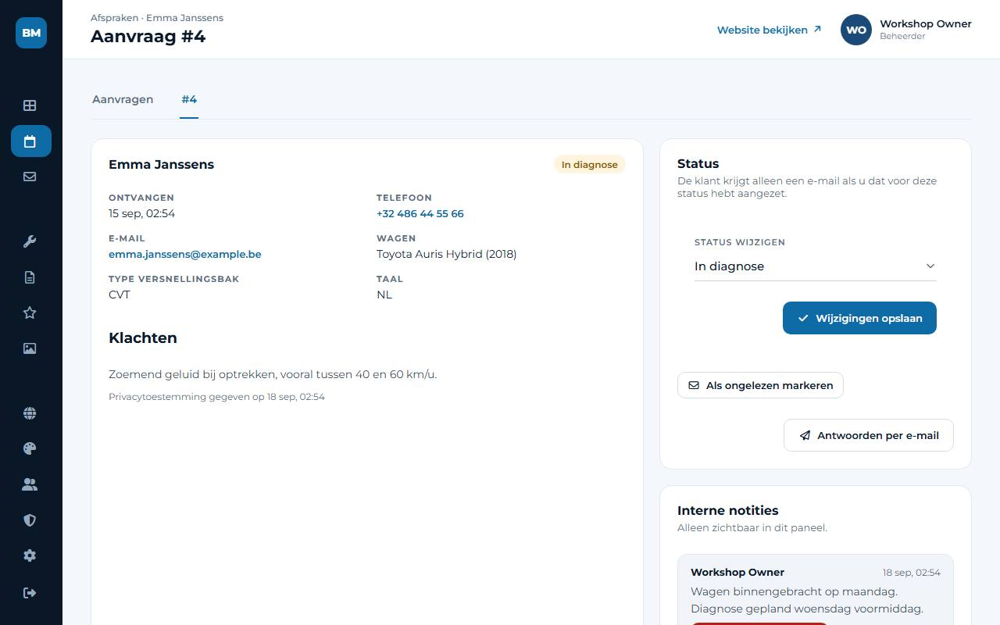

De lijst **Afspraken** kunt u met de gekozen filters naar een rekenblad exporteren (**CSV exporteren**). Elke
statuswijziging, notitie en export wordt in het beveiligingslogboek bijgehouden.

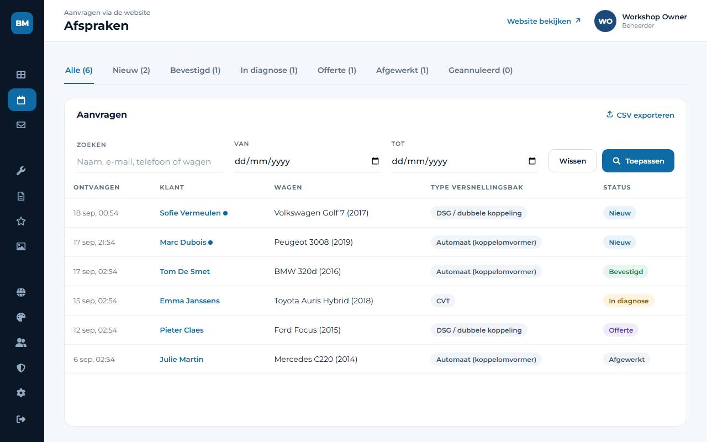

## De teksten van de website

### Pagina's

Onder **Pagina's** staan de pagina's van de website. Elke pagina heeft een tabblad per taal (NL, FR, EN) met de
teksten, het webadres en de velden die zoekmachines tonen (de SEO-titel en -omschrijving).

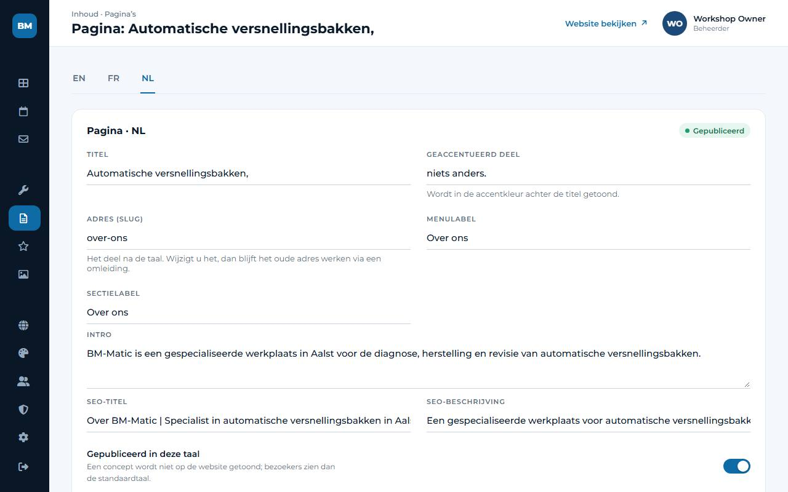

- Schrijf de tekst in één taal, klik op **Opslaan** en ga dan naar het volgende tabblad. Elke taal blijft apart.
- Een vertaling in **concept** wordt niet aan bezoekers getoond; zij zien dan de standaardtaal. Zet **Gepubliceerd in
  deze taal** aan wanneer de tekst klaar is. Een puntje achter een taaltabblad betekent dat die vertaling nog een
  concept is.
- Als u het webadres van een pagina wijzigt, blijft het oude adres werken: het paneel maakt zelf een doorverwijzing,
  zodat bewaarde links en wat Google kent blijven werken.
- Op de homepage ziet u ook de **secties**. Sleep ze in een andere volgorde (of gebruik de pijltjes), zet de secties
  die u niet nodig hebt uit en klik op **Volgorde opslaan**. **Teksten bewerken** opent de teksten van een sectie, per
  taal.

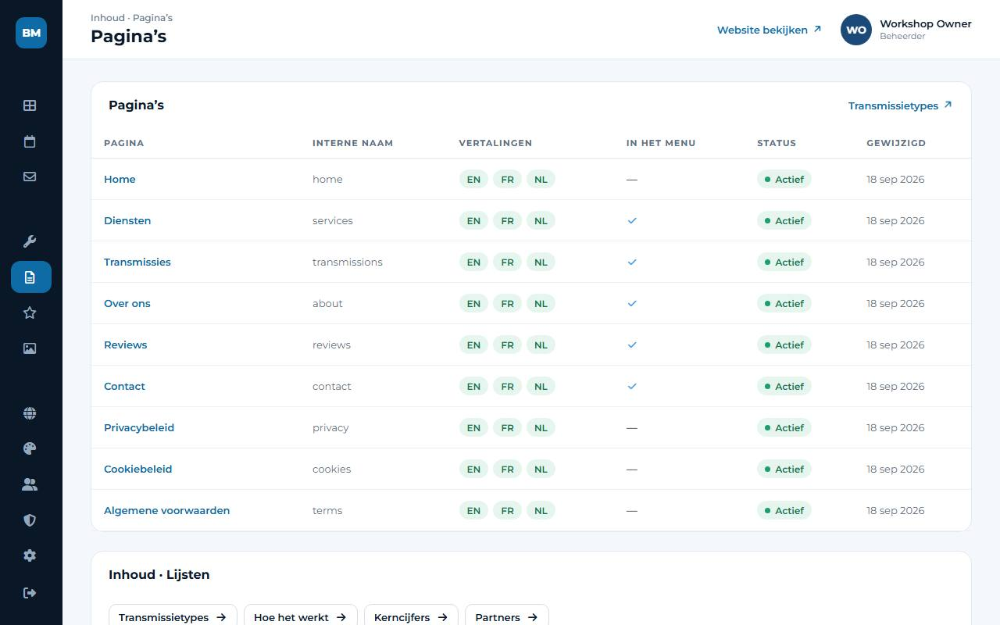

### Diensten en de korte lijsten

**Diensten** werkt op dezelfde manier, met daarbij een pictogram uit een vaste reeks en schakelaars voor het menu en de
homepage. Een nieuwe dienst staat eerst onzichtbaar, zodat u rustig kunt schrijven. Een verwijderde dienst stuurt zijn
oude adres door naar de dienstenpagina.

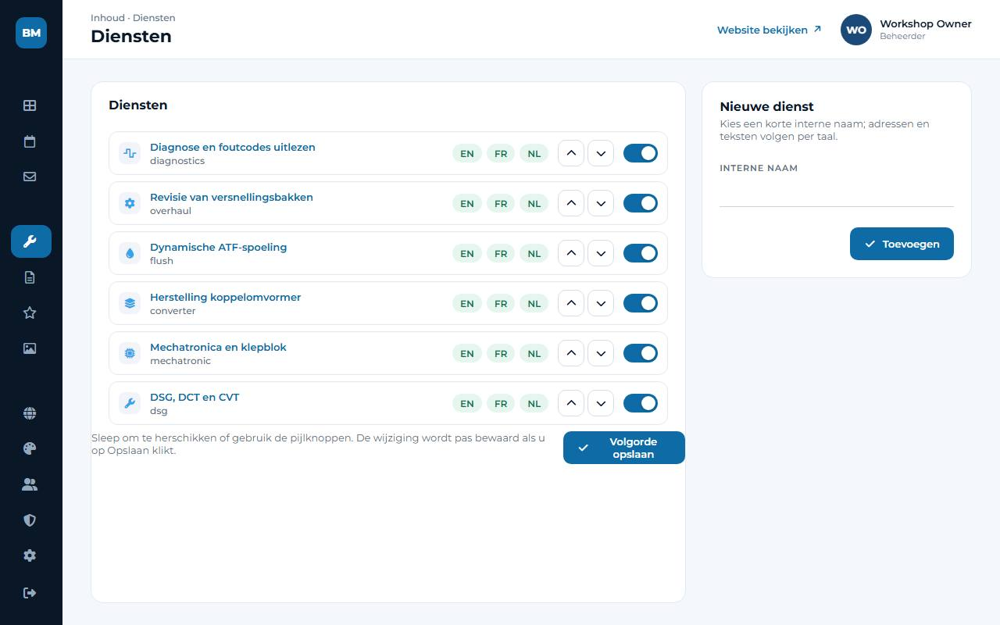

**Transmissies**, **Hoe het werkt**, **Kerncijfers** en **Partners** zijn korte lijsten: één rij per item met de
teksten van de taal die u bewerkt, een volgorde en een zichtbaarheidsschakelaar.

De **juridische pagina's** (privacybeleid, cookiebeleid, algemene voorwaarden) werden geleverd als sjablonen voor het
Belgische recht. Alles tussen [vierkante haakjes] moet ingevuld zijn — en de teksten nagekeken — voor de website
online gaat.

## Foto's en logo's

Onder **Media** staan het logo, de logo's van partners en foto's. Enkel PNG, JPEG en WebP worden aanvaard (hoogstens
6 MB en 25 megapixel — een gewone smartphonefoto is goed). Elke afbeelding wordt bij het opladen opnieuw opgeslagen,
zodat locatiegegevens van een smartphone nooit op de website belanden.

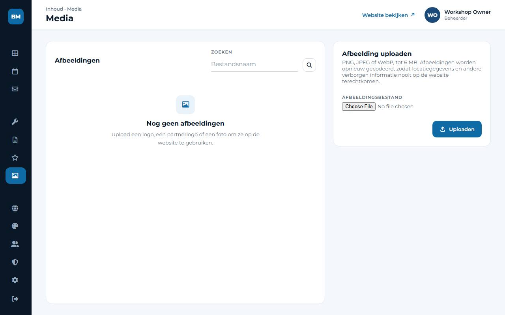

- Geef elke afbeelding een **alternatieve tekst** in elke taal — één korte zin over wat erop staat. Schermlezers lezen
  hem voor en zoekmachines gebruiken hem.
- **Bestand vervangen** wisselt het bestand, maar de afbeelding blijft overal staan waar ze gebruikt wordt.
- Voor u een afbeelding verwijdert, toont het paneel waar ze gebruikt wordt ("Pagina's (2)"), zodat er niets per
  ongeluk verdwijnt.

## Google-reviews

De reviews die uw klanten op Google achterlaten, in één lijst. Nieuwe reviews komen **verborgen** binnen: er verschijnt
niets op de website tot u ze aanzet in de kolom **Op de website**. **Alles tonen** / **Alles verbergen** doet dat in één
keer voor alles wat aan de filters voldoet. De tabbladen tellen wat u hebt: alle, zichtbare, verborgen.

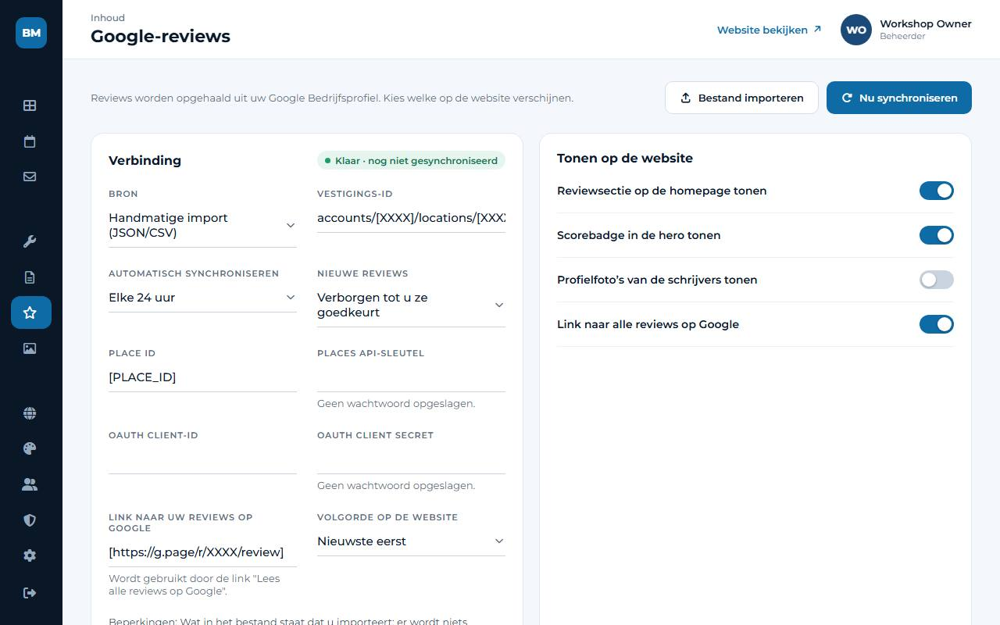

De sterren en het aantal reviews zijn altijd de cijfers van Google zelf — de website berekent nooit een gemiddelde van
de reviews die u toevallig toont, want dat zou bezoekers misleiden (en de Europese regels voor consumenten laten het
niet toe). Daarom blijven ook het label "Google-reviews", de vermelding "via Google" bij elke review en de link naar uw
Google-profiel staan.

De kaart **Verbinding** toont waar de reviews vandaan komen, wanneer ze laatst opgehaald werden, wanneer het volgende
keer gebeurt en wat er misliep als er iets misliep. Een verbroken verbinding raakt de website nooit: wat u goedkeurde,
blijft online. De koppeling met Google staat stap voor stap uitgelegd in
[docs/GOOGLE-REVIEWS.md](docs/GOOGLE-REVIEWS.md) (in het Engels; uw ontwikkelaar kan helpen).

## Vormgeving

Het logo, het favicon, de kleuren, de afronding van de hoeken en de bewegingen. Klik op het gekleurde vierkantje voor
een kleurcode om een kleur te kiezen, of typ de code zelf. De kleurvelden tonen meteen een contrastcontrole: onder 4,5:1 wordt tekst voor veel mensen moeilijk leesbaar, en het paneel waarschuwt u. **Terug naar
het goedgekeurde ontwerp** zet alles terug zoals het ontwerp werd goedgekeurd.

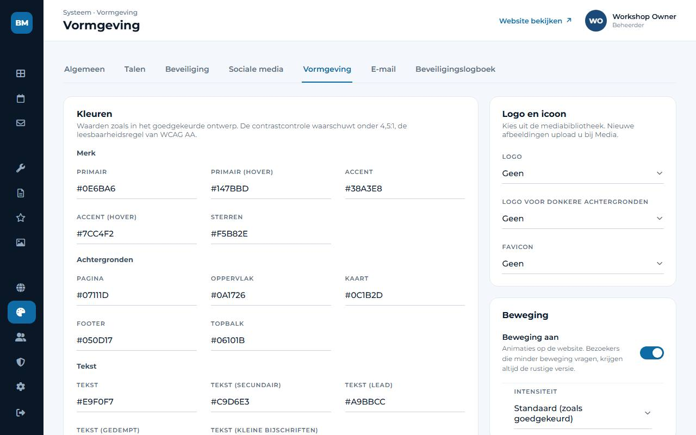

## Instellingen

- **Algemeen** — bedrijfsgegevens (naam, btw-nummer), adres, telefoon, e-mail, openingsuren, en schakelaars voor online
  boeken, de actiebalk op smartphones en de onderhoudsmodus.
- **Talen** — welke talen bezoekers kunnen kiezen, welke de standaardtaal is, en hoeveel van de interface vertaald is.
- **Sociale media** — één regel per netwerk: de link, en of hij in de header, de footer of allebei verschijnt.
- **E-mail** — de mailserver die de afspraakmails verstuurt, **Testmail versturen**, en **E-mails aan klanten**: per
  status een schakelaar en een tekst in elke taal (kant-en-klare teksten zijn meegeleverd; alles staat uit tot u een
  status aanzet).
- **Beveiliging** — tweestapsverificatie, de blokkering na foute wachtwoorden, de sessieduur, HTTPS afdwingen en het
  beheeradres. **Beveiligingslogboek** toont wie wat deed, met filters en export.
- **Onderhoud** (beheerders) — wat anders de opdrachtregel van uw ontwikkelaar vraagt:
  - **Geplande taken**: het geheime adres dat een externe dienst (cron-job.org) elke 15 minuten opent, zodat e-mails
    vertrekken, reviews binnenkomen en er elke dag een back-up gemaakt wordt. **Nu uitvoeren** doet het meteen;
    **Nieuw adres** vervangt het adres als het ooit uitlekte (plak het daarna opnieuw bij cron-job.org).
  - **Back-ups**: **Back-up maken**, er een **Downloaden** om een kopie buiten de server te bewaren (doe dat af en
    toe), en een eerder gedownloade back-up **Uploaden**.
  - **Back-up terugzetten**: zet de hele website terug zoals ze was bij die back-up — kies ze, geef uw wachtwoord en
    typ RESTORE. Eerst wordt een back-up van de huidige toestand gemaakt, zodat u terug kunt. Daarna meldt iedereen
    zich opnieuw aan; u blijft zich aanmelden met uw huidige e-mailadres en wachtwoord. Dat werkt ook op een **nieuwe
    installatie**: installeer de site, meld u aan, **Upload** de back-up die u eerder downloadde en zet ze terug. Het
    beheeradres van de nieuwe installatie blijft. Kijk daarna Instellingen → E-mail na en zet tweestapsverificatie
    opnieuw aan (die kan niet mee overgezet worden).
  - **Bewaking**: het adres voor een bewakingsdienst. **Voor de lancering**: elke [plaatshouder], ontbrekende
    vertaling of alt-tekst die nog overblijft. **Statistieken**: uit, Google Analytics of Plausible (alleen na
    toestemming van de bezoeker).

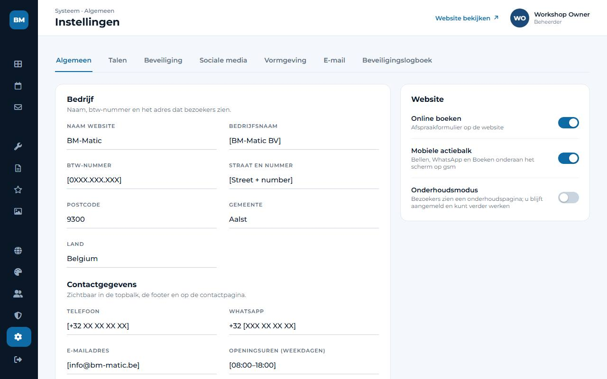

## Gebruikers

Nodig een collega uit per e-mail: die krijgt een link die drie dagen geldig is en kiest zelf een wachtwoord.

- Een **Beheerder** mag alles.
- Een **Redacteur** werkt met aanvragen, teksten, foto's en reviews, maar ziet geen gebruikers, instellingen,
  beveiliging of vormgeving.

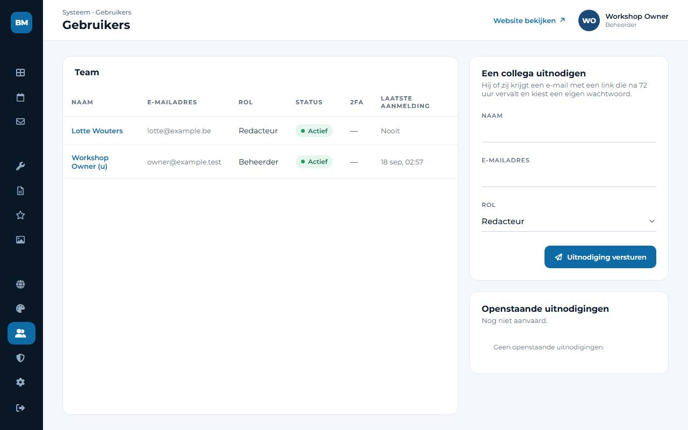

Gebruikers worden nooit verwijderd, omdat het beveiligingslogboek moet blijven kloppen — u deactiveert ze, en dat kunt u
altijd terugdraaien. De laatste actieve beheerder kan niet gedeactiveerd of teruggezet worden, zodat niemand ooit
buitengesloten raakt.

Uw eigen naam, e-mailadres en wachtwoord staan onder **Mijn profiel**. Een nieuw e-mailadres geldt pas nadat u het
vanaf dat adres bevestigde, en een nieuw wachtwoord meldt u af op uw andere toestellen.

## Tweestapsverificatie

Met tweestapsverificatie hebt u bij het aanmelden uw wachtwoord **en** een code van zes cijfers uit een app op uw
smartphone nodig (Google Authenticator, Microsoft Authenticator, 1Password, Bitwarden…). Wie uw wachtwoord kent, raakt
er dan nog niet in. Zet het aan voor elke beheerder.

1. **Beveiliging → Tweestapsverificatie inschakelen**, en bevestig met uw wachtwoord.
2. Scan de QR-code met de app en typ de code van zes cijfers die ze toont.
3. U krijgt **tien herstelcodes**. Bewaar ze in uw wachtwoordbeheerder, of druk ze af en berg ze veilig op: elke code
   werkt één keer, voor als u uw smartphone kwijt bent.

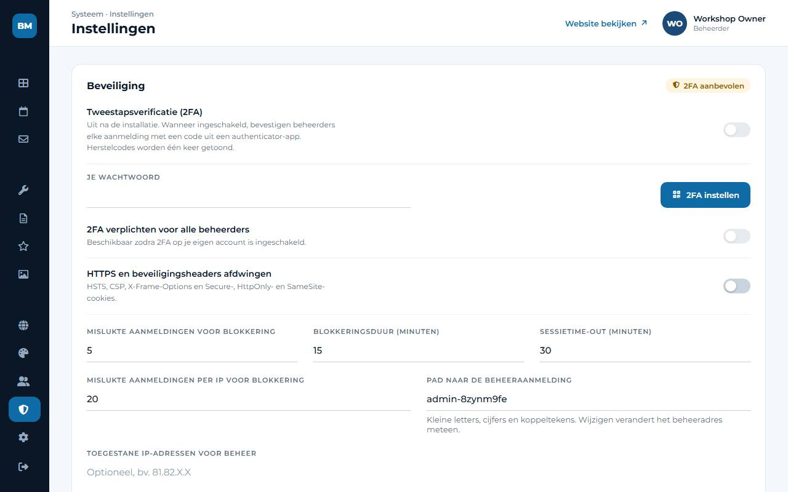

Vanaf dan vraagt het paneel na uw wachtwoord om de code. Een beheerder kan tweestapsverificatie verplicht maken voor
iedereen, onder **Beveiliging**.

## Als er iets misloopt

| Wat u ziet | Wat u doet |
| --- | --- |
| "Pagina niet gevonden" op het beheeradres | Controleer het adres in uw wachtwoordbeheerder; uw ontwikkelaar kan het opnieuw opvragen. |
| Uw account is geblokkeerd na foute wachtwoorden | Wacht 15 minuten, of vraag uw ontwikkelaar om het te deblokkeren. |
| U bent uw wachtwoord vergeten | Klik op **Wachtwoord vergeten?** op het aanmeldscherm en volg de link in de e-mail. Geen e-mail? Kijk bij ongewenste mail, of vraag het uw ontwikkelaar. |
| Uw smartphone met de authenticator-app is weg | Meld u aan met een van uw herstelcodes en stel tweestapsverificatie opnieuw in. Geen codes meer: uw ontwikkelaar kan ze resetten. |
| "Er ging iets mis" met een code (bijvoorbeeld 7K2QF9XM) | Noteer de code en stuur ze naar uw ontwikkelaar — ze wijst precies aan wat er gebeurde. |
| Klanten zeggen dat het formulier niet werkt | Kijk of **Online boeken** aan en de onderhoudsmodus uit staat (dashboard), en stuur uzelf een testaanvraag. |
| Afspraakmails komen niet aan | **Instellingen → E-mail → Testmail versturen**; kijk in de map met ongewenste mail; lukt de test niet, verwittig uw ontwikkelaar. |
| Reviews worden niet meer bijgewerkt | Open **Google-reviews**: de verbindingskaart zegt waarom ([docs/GOOGLE-REVIEWS.md](docs/GOOGLE-REVIEWS.md)). De website blijft tonen wat u goedkeurde. |
| U wijzigde of verwijderde iets per vergissing | De meeste wijzigingen kunt u gewoon opnieuw doen. Voor verloren teksten of foto's kan een beheerder de back-up van afgelopen nacht terugzetten via **Instellingen → Onderhoud** (alles na die back-up gaat verloren, overleg dus eerst). |

De maandelijkse routine van uw ontwikkelaar (back-ups, updates, bewaking) staat in [MAINTENANCE.md](MAINTENANCE.md).
